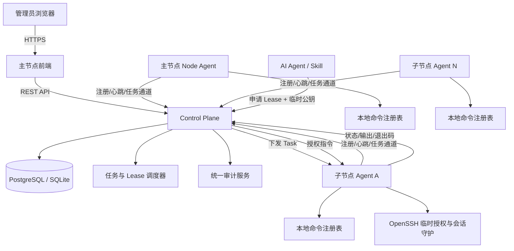
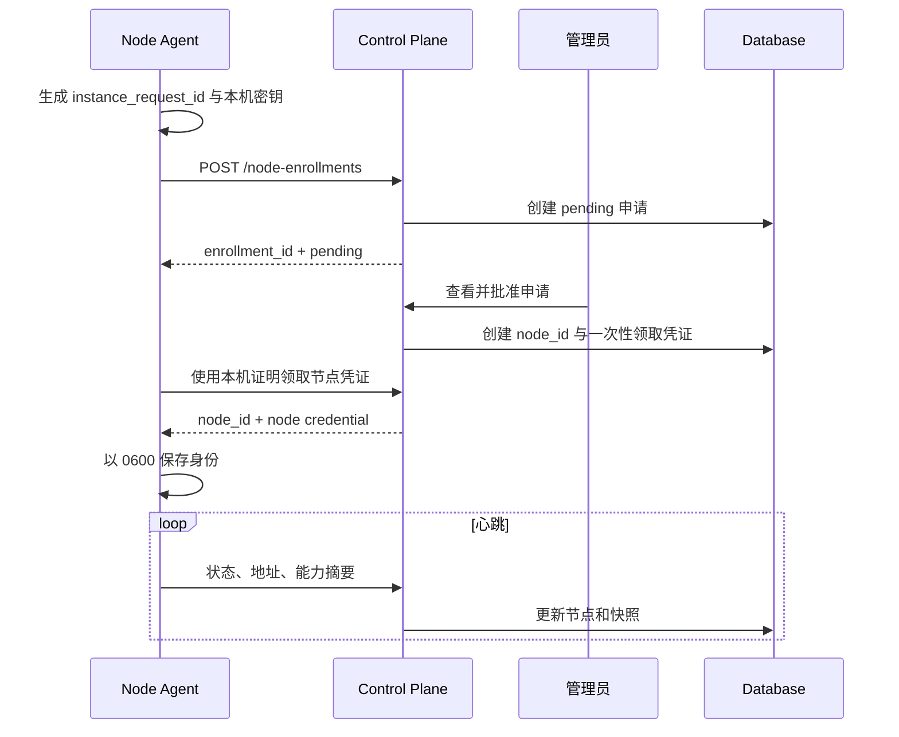
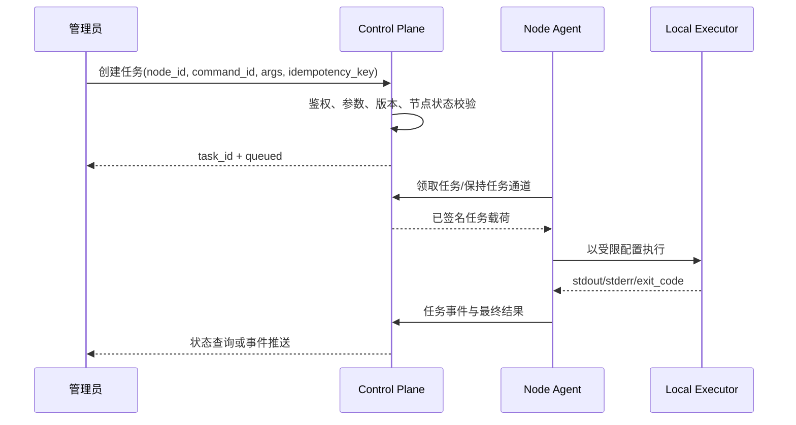

# ServerCLI 总体架构设计

> 日期：2026-08-07  
> 本文描述建议实现基线，具体语言与框架可在实现阶段调整，但组件边界和安全约束应保持。

## 1. 建议技术栈

| 层 | 建议 |
| --- | --- |
| 后端 / Control Plane / Node Agent | Go，便于编译单文件、并发任务与跨 Linux 部署 |
| 前端 | React + TypeScript + Vite |
| 正式数据库 | PostgreSQL |
| 测试数据库 | SQLite（WAL 模式） |
| 数据访问 | 显式 SQL + 兼容 PostgreSQL/SQLite 的迁移层 |
| 服务托管 | 源码构建后由 systemd 管理；测试可提供前台开发模式 |
| 通信 | HTTPS REST + 节点长轮询或 WebSocket 任务通道 |
| SSH 临时授权 | OpenSSH + 临时公钥 + Node Agent 管理授权文件/会话包装器 |

## 2. 逻辑架构

## 3. 部署单元

### 3.1 主服务器

主服务器运行：

- 主节点前端；
- Control Plane 后端；
- 环境数据库连接；
- 调度器、清理器和审计服务；
- 主节点自己的 Node Agent；
- 可选的本机 SSH Lease 执行组件。

### 3.2 子服务器

每个子节点运行：

- Node Agent；
- 本地命令注册表；
- 任务执行器；
- SSH Lease 执行组件；
- 可选的本机只读/自管理前端和 API。

### 3.3 测试环境同 IP 双实例

测试主实例与测试子实例都位于 `<test-server-ip>`。它们是两个逻辑节点，必须隔离：

| 项目 | 主实例 | 子实例 |
| --- | --- | --- |
| 角色 | `primary` | `child` |
| 前端 | `9044` | `9046` |
| 后端 | `9045` | `9047` |
| state | 独立目录 | 独立目录 |
| 日志 | 独立目录 | 独立目录 |
| 节点凭证 | 独立 | 独立 |
| `node_id` | 独立 UUID | 独立 UUID |

因此，IP 不能作为节点唯一约束。地址唯一性最多使用 `(environment, ip, service_port, instance_name)`，权威身份仍是 `node_id`。

## 4. 组件职责

### 4.1 Control Plane

- 管理员认证和会话。
- 节点注册审批、凭证签发、禁用和状态聚合。
- 保存命令能力快照。
- 创建任务、分派任务、接收事件和结果。
- 创建、续期、撤销 SSH Lease。
- 汇总审计与数据保留。
- 向主节点 UI 提供全局 API；向子节点本机 UI 提供受限 API。

### 4.2 Node Agent

- 生成和保存本机实例身份。
- 主动连接 Control Plane，不依赖主节点直接 SSH 到子节点执行普通命令。
- 收集系统基础信息和资源摘要。
- 加载本地命令 manifest，并上报版本化清单。
- 从任务通道领取任务并使用受限执行器运行。
- 管理临时 SSH 公钥、Lease 状态和活动会话。
- 将结果和本地审计发送到 Control Plane；断网时有限缓冲并重试。

### 4.3 命令执行器

- 只接受已注册的 `command_id + version`。
- 使用 JSON Schema 校验参数。
- 参数以 argv 或结构化输入传递，禁止字符串拼接 Shell。
- 支持超时、取消、并发限制、工作目录限制和环境变量白名单。
- sudo 只能调用预先配置的精确 wrapper，不允许 `sudo sh -c <用户输入>`。

### 4.4 审计服务

- 使用全局 `request_id / task_id / lease_id / session_id` 关联事件。
- 本地事件先写追加式缓冲，再异步上报。
- Secret 脱敏在落盘前完成，不能只在 UI 层遮挡。

## 5. 节点注册流程

### 注册安全规则

1. 来源 IP 只用于风险判断和地址记录，不直接证明身份。
2. 一次性领取凭证只能使用一次，且有短 TTL。
3. 节点凭证与本机实例密钥绑定；复制 state 到另一实例应触发冲突或重新注册。
4. 主角色只允许由环境静态配置指定的实例获得，子节点不能自行声明升级。

## 6. 任务执行流程

幂等键应保证网络重试不会重复创建任务；Agent 还应维护短期执行去重缓存，避免任务已执行但结果确认丢失时再次运行。

## 7. 数据一致性原则

- Control Plane 数据库是集群级权威数据源。
- Node Agent 本地 state 是节点身份和离线缓冲的权威副本，不承载全局配置。
- 任务状态采用单向状态机；已进入终态的任务不能回到运行态。
- Lease 的绝对上限由 `issued_at` 计算，续期不得重置首次签发时间。
- SQLite 只用于测试，不支持多 Control Plane 实例并发写入。

## 8. 网络与信任边界

- 浏览器到前/后端：HTTPS；正式环境不得裸 HTTP 登录。
- Agent 到 Control Plane：优先 mTLS；最低要求为 TLS + 节点独立 Token/签名。
- Control Plane 不保存 SSH 私钥；AI 只上传公钥。
- 主节点调用子节点命令走 Agent 通道，不默认使用运维账号密码直接 SSH。
- 防火墙只开放必要的前端/后端端口；Agent 本地主动出站可减少子节点对外暴露。
