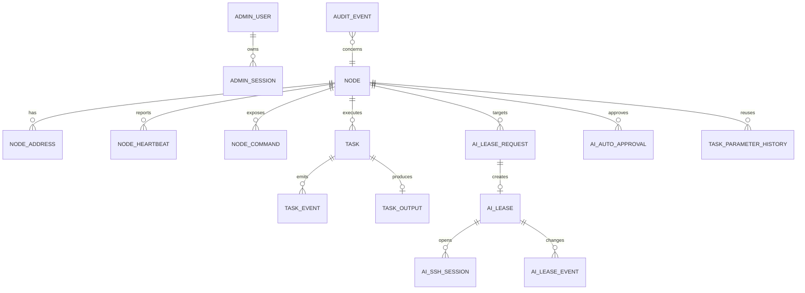

# 数据模型与保留策略

> 日期：2026-08-07  
> 目标：使用同一逻辑模型兼容正式 PostgreSQL 与测试 SQLite。

## 1. 通用原则

1. 主键优先使用 UUID/ULID 字符串，避免数据库自增差异。
2. 时间统一保存 UTC，字段使用 `*_at` 命名。
3. 布尔值、枚举和 JSON 的写法由数据访问层统一转换。
4. SQLite 必须启用外键；PostgreSQL 使用约束和索引保证并发一致性。
5. 所有会被自动清理的表包含 `protected_at` 或 `is_protected`。
6. Secret 不进入通用业务表；Token 只保存不可逆哈希和前缀。
7. 大文本输出与结构化元数据分离，以便独立控制保留期和大小。

## 2. 核心实体关系



## 3. 表设计草案

### 3.1 `admin_user`

| 字段 | 说明 |
| --- | --- |
| `id` | 固定管理员 UUID |
| `username` | 唯一登录名 |
| `password_hash` | Argon2id 哈希 |
| `password_changed_at` | 最近改密时间 |
| `failed_login_count` | 连续失败次数 |
| `locked_until` | 临时锁定截止时间 |
| `created_at/updated_at` | 时间 |

首版限制最多一个有效管理员账号，可由业务层和数据库约束共同保证。

### 3.2 `admin_session`

- `id`
- `admin_user_id`
- `token_hash`
- `csrf_secret_hash` 或服务端会话元数据
- `ip_address`
- `user_agent`
- `expires_at`
- `revoked_at`
- `last_seen_at`

### 3.3 `node_enrollment`

- `id`
- `instance_request_id`：实例生成的幂等标识
- `requested_role`
- `hostname`
- `source_ip`
- `reported_addresses_json`
- `agent_version`
- `status`：`pending/approved/rejected/expired/claimed`
- `reviewed_by/reviewed_at/review_note`
- `claim_token_hash/claim_expires_at/claimed_at`
- `created_at`

唯一约束建议为 `(environment_id, instance_request_id)`。

### 3.4 `node`

- `id`：不可变 `node_id`
- `environment_id`
- `instance_name`
- `alias`
- `role`：`primary/child`
- `hostname`
- `status`
- `enabled`
- `agent_version/app_version`
- `os_name/os_version/arch`
- `frontend_port/backend_port`
- `last_heartbeat_at/last_online_at`
- `labels_json/metadata_json`
- `credential_version`
- `created_at/updated_at`

约束：一个环境只能有一个启用的 `primary`。PostgreSQL 可使用部分唯一索引；SQLite 由事务与触发器/业务层保证。

### 3.5 `node_address`

- `id`
- `node_id`
- `address`
- `address_type`：`source/reported/public/private/loopback`
- `service_port`
- `first_seen_at/last_seen_at`
- `is_preferred`

IP 不设置全局唯一约束。

### 3.6 `node_heartbeat`

保存低频或聚合后的运行数据：

- `id/node_id/recorded_at`
- `cpu_usage_percent`
- `memory_total_bytes/memory_used_bytes`
- `disk_total_bytes/disk_used_bytes`
- `load_1/load_5/load_15`
- `uptime_seconds`
- `time_offset_ms`
- `summary_json`
- `is_protected/protected_at`

当前状态也应冗余到 `node`，避免首页每次扫描历史表。

### 3.7 `node_command`

- `id`
- `node_id`
- `command_id`
- `command_version`
- `capability_id/category`
- `title/description`
- `parameter_schema_json`
- `permission_profile`
- `timeout_seconds/max_output_bytes`
- `enabled`
- `manifest_hash`
- `first_seen_at/last_seen_at`

唯一约束：`(node_id, command_id, command_version)`。

### 3.8 `task`

- `id`
- `node_id`
- `command_id/command_version`
- `requested_by`
- `idempotency_key`
- `arguments_json`
- `status`
- `queued_at/started_at/finished_at`
- `timeout_seconds`
- `exit_code/error_code/error_message`
- `result_summary_json`
- `is_protected/protected_at`

唯一约束：`(requested_by, idempotency_key)`，并限定幂等窗口或永久唯一。

### 3.9 `task_event`

记录状态转换：

- `id/task_id/sequence`
- `event_type`
- `status`
- `message`
- `occurred_at`
- `source`：`control-plane/agent/executor`

唯一约束：`(task_id, sequence)`。

### 3.10 `task_output`

- `task_id`
- `stdout_text/stderr_text` 或外部对象引用
- `stdout_bytes/stderr_bytes`
- `truncated`
- `redaction_count`
- `encoding`
- `created_at`
- `is_protected/protected_at`

### 3.11 `ai_lease_request`

- `id`
- `client_request_id`：幂等键
- `access_token_id`（可空）：来源 Access Token（新数据必填，旧数据为空）
- `ai_agent_id/ai_agent_name`
- `node_id`
- `requested_profile`
- `requested_duration_seconds`
- `public_key_fingerprint`
- `purpose`
- `status`：`pending/approved/rejected/failed/cancelled`
- `decision_reason`
- `source_ip/client_metadata_json`
- `created_at/decided_at`
- `is_protected/protected_at`

只保存公钥或公钥指纹；不得保存 AI 私钥。

### 3.12 `ai_lease`

- `id`
- `request_id/node_id`
- `access_token_id`（可空）：来源 Access Token（新数据必填，旧数据为空）
- `ai_agent_id`
- `permission_profile`
- `public_key/public_key_fingerprint`
- `issued_at`
- `expires_at`
- `absolute_expires_at`：固定为首次签发 + 最多 24h
- `last_renewed_at/renew_count`
- `status`：`active/disconnected/expired/revoked/failed`
- `revoked_at/revoke_reason`
- `renewal_disabled`
- `active_session_count`
- `is_protected/protected_at`

数据库约束应保证 `expires_at <= absolute_expires_at`。

### 3.13 `ai_lease_event`

- `id/lease_id`
- `event_type`：`issued/renewed/renew_denied/revoked/expired/disconnected/install_failed`
- `actor_type/actor_id`
- `details_json`
- `occurred_at`

### 3.14 `ai_ssh_session`

- `id/lease_id/node_id`
- `remote_address`
- `connection_id`
- `os_pid/cgroup_id`
- `started_at/last_seen_at/ended_at`
- `end_reason`
- `exit_code`
- `command_count`
- `recording_ref`
- `is_protected/protected_at`

### 3.15 `audit_event`

- `id`
- `occurred_at`
- `environment_id/node_id`
- `actor_type`：`admin/ai_agent/node/system`
- `actor_id`
- `action`
- `resource_type/resource_id`
- `result`：`success/denied/failure`
- `request_id/task_id/lease_id/session_id`
- `source_ip`
- `summary`
- `details_json`
- `risk_level`
- `is_protected/protected_at/protected_by`

### 3.16 `system_setting`

保存非 Secret 动态设置，例如：

- 默认/最大 Lease 时长；
- 新申请、自动审批、续期开关；
- 断连宽限时间；
- 清理周期与各表保留期；
- 心跳和离线阈值；
- 输出上限与并发限制。

Secret 使用外部配置，不写该表。

### 3.17 `cleanup_run`

- `id`
- `started_at/finished_at`
- `trigger_type`：`schedule/manual/dry_run`
- `policy_snapshot_json`
- `candidate_count/deleted_count/skipped_protected_count`
- `status/error_message`
- `requested_by`

### 3.18 `ai_auto_approval`（历史保留，不再参与审批）

> Access Token 自动审批上线后，本表仅用于历史追溯：不再参与申请匹配，也不再提供管理 API/UI。节点删除时仍随节点级联清理。

- `id`、`environment_id`
- `ai_agent_id` / `ai_agent_name`：设备身份（沿用 Lease 申请的 `ai_agent_id`）
- `node_id`：免审批目标节点
- `source_request_id`：创建该规则时的来源申请
- `created_by`、`created_at`、`updated_at`
- `expires_at`：到期时间
- 唯一约束 `(environment_id, ai_agent_id, node_id)`：同一设备访问同一节点只保留一条规则，延长/重新创建时更新到期时间
- 有效期上限 15 天；延长从当前到期时间累加但不超过“操作时刻 + 15 天”

### 3.18.1 `api_access_token`

- `id`、`environment_id`、`name`
- `token_hash`：SHA-256 哈希（唯一）
- `token_prefix`：可识别前缀（如 `sct_8995d790`）
- `created_by`、`created_at`
- `expires_at`：永久 Token 为 `NULL`
- `revoked_at`、`revoked_by`
- `last_used_at`、`last_used_ip`、`usage_count`
- `permissions_json`：结构化权限 JSON，形如 `{"version":1,"grants":[{"resource":"...","actions":["..."],"constraints":{}}]}`。新 Token 创建即**零权限**（`{"version":1,"grants":[]}`），权限由管理员按静态权限目录（`notifications:send`；`nodes:read`；`ai.lease_requests:create/read`；`ai.leases:renew/heartbeat/disconnect`）显式授予。其中 `version` 是权限 schema 版本（首版 = 1），与乐观锁 `permission_version` 无关。
- `permission_version`：乐观锁 revision；每次权限更新 +1，更新接口必须携带当前值，冲突/撤销/过期返回 409。Token 列表/详情接口返回解析后的 `permissions` 对象（非法 JSON fail closed 为空授权集，不泄露原始 JSON）。

明文只返回一次；日志/错误/示例不得出现完整 Token。

> **历史数据与迁移 0006**：0005 之前创建的 Token 权限为 canonical wildcard（`{"version":1,"grants":[{"resource":"*","actions":["*"]}]}` 或其带 `constraints` 形态）。
> 迁移 `0006_legacy_wildcard_permissions.sql` **仅精确匹配这两种历史 canonical wildcard JSON**，改写为显式完整 AI 凭证权限
> （`nodes:read`、`ai.lease_requests:create/read`、`ai.leases:renew/heartbeat/disconnect`），**不授予通知权限**；
> 非 canonical、手工修改或任何其他形态的 JSON 不被覆盖，迁移幂等可重放。
> 任何残留 wildcard / NULL / 空 / 非法 JSON 一律 **fail closed**（拒绝授权 + 告警 + 审计）。
> 回滚不会恢复发布窗口中新 Token 的权限（权限是数据而非代码），必要时人工重新授权或重建（见 12_NOTIFICATION_MIGRATION.md §6）。

### 3.18.2 `api_token_usage_log`

- `id`、`token_id`、`environment_id`
- `request_id`、`occurred_at`
- `method`、`route`（规范化路由模板）、`resource`、`action`
- `source_ip`、`user_agent`
- `status_code`、`outcome`（`success/denied/failure`）
- `lease_request_id`、`lease_id`：关联资源
- `token_state`：`valid/expired/revoked`

### 3.19 `task_parameter_history`

- `id`、`node_id`、`command_id`、`command_version`
- `arguments_json`：完整参数（含敏感字段，仅管理员接口返回）
- `arguments_hash`：规范化参数 JSON 的 SHA-256
- `last_task_id`、`first_used_at`、`last_used_at`、`use_count`
- 唯一约束 `(node_id, command_id, command_version, arguments_hash)`；重复使用只累加次数
- 任务入队后写入；空参数不记录；删除节点时随节点级联删除

## 4. 状态机

### 4.1 Task

```text
queued -> dispatched -> running -> succeeded
                              \-> failed
                              \-> timed_out
                              \-> cancelled
                \-> node_unreachable
                \-> result_unknown
```

终态不可逆。`result_unknown` 表示可能已执行但 Control Plane 未收到可信终态，禁止自动重试具有副作用的命令。

### 4.2 AI Lease

```text
request: (token 校验通过) approved -> lease active     // 自动审批
                \-> rejected          // 开关关闭/参数无效（遗留 pending 启动时统一置为 rejected）
                \-> failed

lease: active -> renewed -> active
             \-> disconnected
             \-> expired
             \-> revoked
             \-> failed
```

`disconnected/expired/revoked` 均为终态；重新连接需要新 Lease。

## 5. 默认保留策略

| 数据 | 默认保留 | 说明 |
| --- | ---: | --- |
| 节点当前记录 | 永久 | 节点删除建议软删除 |
| 心跳明细 | 7 天 | 可聚合后删除明细 |
| 任务元数据 | 30 天（待确认） | 用户只明确过期清理 7 天，任务建议更长 |
| 任务完整输出 | 7 天 | 重要任务可保护 |
| AI 申请记录 | 30 天（待确认） | 安全审计建议长于普通日志 |
| 过期 Lease | 30 天（待确认） | 不包含私钥 |
| SSH 会话记录 | 7 天 | 终端录像如启用需独立容量策略 |
| 普通审计 | 7 天（当前明确默认） | 可配置 |
| 重要审计 | 不自动删除 | 只能手动删除 |
| 清理运行记录 | 90 天（待确认） | 避免清理行为不可追踪 |

若希望所有过期数据统一为 7 天，应在实现前明确覆盖上表建议值。

## 6. 清理算法

1. 读取配置并生成策略快照。
2. 以数据库 UTC 时间计算截止点。
3. 按表查询 `expired AND not protected` 候选数量。
4. dry-run 只记录数量。
5. 正式删除时按小批量事务处理，并设置单次删除上限。
6. 先删除大对象/输出，再删除父记录；审计事件按策略独立处理。
7. 生成 `cleanup_run` 和 `audit_event`。
8. 清理任务不能删除本次清理审计。

## 7. 数据库兼容测试

每个迁移和 Repository/Store 合约测试必须同时运行：

- SQLite 临时文件数据库；
- PostgreSQL 隔离测试数据库。

重点检查 UUID、时间、JSON、布尔值、唯一约束、事务、并发幂等和部分索引差异。
