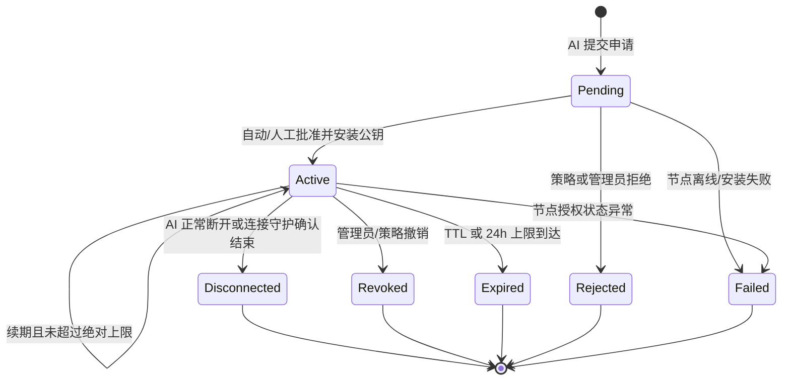
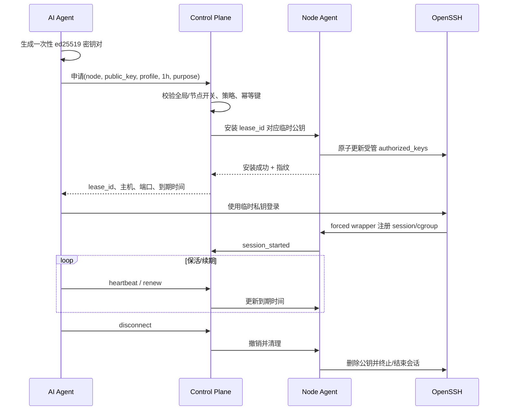

# AI Agent 临时 SSH Lease 设计

> 日期：2026-08-07  
> 目标：允许 AI Agent 在最小权限、短生命周期、可撤销、可审计的前提下登录指定服务器。

## 1. 安全结论

AI Agent **不得使用管理员提供的长期 SSH 密码**。推荐流程是：

1. AI 客户端本地生成一次性 SSH 密钥对。
2. 私钥始终保留在 AI 客户端临时存储中。
3. AI 只向 ServerCLI 上传公钥。
4. ServerCLI 创建 Lease 并让目标节点安装受约束的临时公钥。
5. Lease 到期、断开或撤销时，节点删除授权并终止对应会话（如果启用强制终止）。

这样即使数据库泄露，也不会得到可直接登录服务器的私钥或长期密码。

## 2. Lease 时间规则

默认配置：

```text
默认时长：1 小时
单次申请最大时长：1 小时（可配置但不得突破绝对上限）
自动续期：允许
绝对生命周期：首次签发后最多 24 小时
断连宽限：建议 60 秒
续期提前量：建议到期前 10 分钟
```

核心约束：

```text
new_expires_at = min(now + requested_extension, absolute_expires_at)
absolute_expires_at = issued_at + 24h
```

续期不得改变 `issued_at` 或 `absolute_expires_at`。达到上限后必须创建新申请。

## 3. Lease 生命周期



## 4. 申请流程



## 5. 节点侧实现建议

### 5.1 专用账号

建议使用专用低权限账号，例如 `servercli-ai`，不要使用日常运维账号。该账号：

- 默认无密码；
- 仅允许公钥登录；
- 禁止端口转发、Agent 转发、X11 转发，除非某个权限配置明确需要；
- 默认无 sudo；
- 通过精确 sudoers wrapper 获得最小权限；
- home、authorized_keys 和审计目录由 root/Agent 管理。

### 5.2 临时 authorized_keys

每个 Lease 对应一条带约束的 key，例如概念形式：

```text
restrict,command="/usr/local/libexec/servercli-lease-shell --lease <lease_id>" ssh-ed25519 AAAA... lease-<id>
```

具体 OpenSSH 版本兼容性需在目标系统验证。可显式添加：

- `no-agent-forwarding`
- `no-port-forwarding`
- `no-X11-forwarding`
- `no-user-rc`
- 是否允许 PTY 由权限配置决定

授权文件必须原子更新、校验所有者/权限，并只允许 Agent 的特权辅助进程写入。

### 5.3 会话包装器

`servercli-lease-shell` 负责：

1. 向 Node Agent 验证 Lease 仍为 active、未到期、未禁用。
2. 创建 Lease 专属 cgroup 或记录进程树。
3. 记录会话开始、连接信息和请求命令。
4. 根据权限配置启动受限 shell、命令代理或审计终端。
5. 会话结束时上报退出状态并触发自动撤销。
6. 撤销时终止该 Lease 的进程组/cgroup。

若不实现会话进程跟踪，删除 authorized_keys 只能阻止新连接，**不能可靠终止已经建立的 SSH 会话**。因此“撤销即终止存量连接”必须作为单独验收项。

## 6. 自动申请与审批策略

建议支持三种模式：

| 模式 | 行为 |
| --- | --- |
| `manual` | 所有申请由管理员批准 |
| `policy` | 低风险、短时长、允许节点和 profile 自动批准，其余人工 |
| `disabled` | 拒绝所有新申请 |

首版建议：测试环境 `policy`，正式环境默认 `manual`。即使自动批准也必须记录完整决策依据。

## 7. 禁止凭证操作

UI 建议分开提供三个动作，避免语义模糊：

1. **暂停新申请**：拒绝新 Lease，不影响现有 Lease。
2. **暂停续期**：现有 Lease 可运行到当前到期时间，AI 无法延期。
3. **紧急撤销全部**：立即撤销目标范围内现有 Lease，并按配置终止会话。

支持作用范围：全局、单节点、单 AI Agent、单 Lease。

## 8. 断开自动失效

### 8.1 正常断开

- AI 客户端调用 `/disconnect`。
- SSH wrapper 检测会话结束并上报。
- Control Plane 把 Lease 标为 `disconnected`，Node Agent 删除公钥。
- 同一 Lease 不允许重新连接；需要新申请。

### 8.2 异常断开

使用多层兜底：

1. SSH 会话进程结束/网络 keepalive 超时，wrapper 上报结束。
2. AI 客户端 Lease heartbeat 中断，超过宽限期后撤销。
3. Lease 自身 TTL 到期后撤销。
4. 节点本地也独立检查到期时间，主节点离线时仍能移除过期授权。

注意：短暂网络抖动可能触发误撤销。建议 60 秒宽限且状态提示清晰；具体数值可配置。

## 9. 续期

续期需满足全部条件：

- Lease 当前为 active；
- 全局、节点、AI 和 Lease 均未禁止续期；
- AI 客户端持有绑定 Lease 的续期令牌或签名能力；
- 公钥指纹、目标节点和权限配置未改变；
- 未超过绝对 24 小时上限；
- 节点仍在线并确认本地授权状态一致；
- 风险策略未要求重新审批。

权限提升、目标节点变更或公钥变更都必须新建申请，不能通过续期完成。

## 10. 权限配置

### `read-only`

- 允许查看系统信息和受限日志。
- 不允许修改文件、重启服务、安装软件或网络访问扩展。
- 默认无 PTY 或只提供受控命令代理，安全性最高。

### `operator`

- 允许调用明确批准的维护 wrapper。
- 可允许 PTY，但仍受命令、路径和 sudoers 限制。
- 正式环境可要求人工批准。

### `admin`

- 首版建议关闭。
- 如必须启用：人工审批、极短时长、来源限制、会话录像、实时告警和强制终止能力缺一不可。

## 11. 审计范围

至少记录：

- 申请内容摘要、公钥指纹和幂等键；
- 自动/人工决策及原因；
- 安装/删除 authorized_keys 的结果；
- 续期请求、批准/拒绝和到期时间变化；
- SSH 会话开始、结束、来源 IP、目标节点和退出状态；
- 通过 wrapper 执行的远程命令；
- sudo、文件变更和服务管理等关键事件；
- 管理员禁用、撤销、保护和删除记录的动作。

不得记录：私钥、密码、完整续期 Token、未脱敏 Secret 和无上限的终端原始内容。

## 12. 可观测性与告警

以下事件建议产生高优先级提示：

- 24 小时内连续大量申请或拒绝；
- 同一公钥指纹申请多个节点；
- 禁止续期后仍反复请求；
- 节点本地存在数据库未记录的临时公钥；
- Lease 已撤销但活动会话仍存在；
- 使用 `admin` profile；
- Agent 无法删除公钥或终止会话。

## 13. 验收用例

1. 默认申请返回 1 小时 Lease。
2. 相同幂等键重试不重复安装公钥。
3. AI 可使用临时私钥登录，长期密码未被使用或返回。
4. 到期前续期成功，但新的到期时间不超过首次签发 + 24 小时。
5. 禁止续期后续期请求被拒绝并审计。
6. 正常断开后 Lease 终止且同一私钥不能再次登录。
7. 异常断网超过宽限期后授权自动清除。
8. 管理员撤销后新连接失败；启用强制终止时现有会话也结束。
9. Node Agent 或 Control Plane 重启后不会恢复已过期/已撤销公钥。
10. 目标节点离线时申请失败或保持 pending，不产生“数据库 active、节点未安装”的假成功。
11. 超过 24 小时必须重新申请。
12. 重要申请/会话记录标记后不被每周清理删除。
